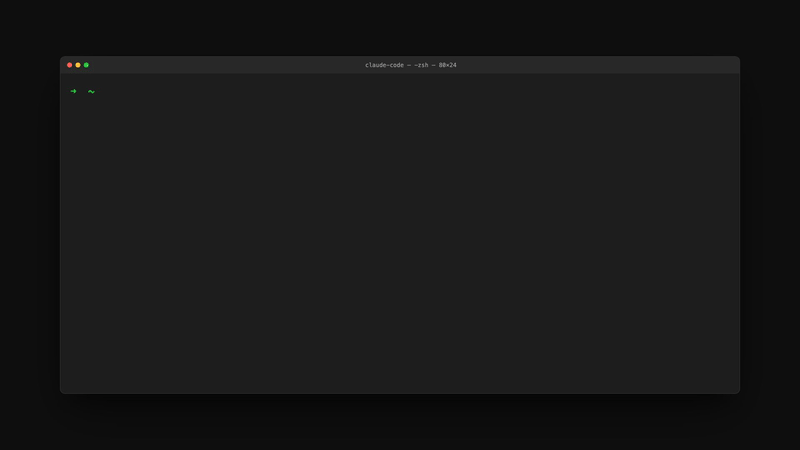

<div align="center">
  <h1>arXiv Researcher</h1>
  <p>
    <strong>Turn Papers into Code Assets</strong> — An AI-Native Agent for the complete research engineering lifecycle.
  </p>
</div>

<p align="center">
  
</p>

<div align="center">
  <p>
    <a href="https://github.com/anthropics/claude-code"></a>
    <a href="https://www.python.org/"></a>
    <a href="LICENSE"></a>
  </p>

  <p>
    [ <a href="README.md">中文</a> | <a href="README.en.md">English</a> | <a href="README.ja.md">日本語</a> ]
  </p>
</div>

## 🚀 The Problem

As an engineer or researcher, you face:
- 📄 **Paper Overload**: 100+ PDFs saved, <10 read.
- 🔧 **Reproduction Hell**: Broken environments, missing dependencies, unrunnable code.
- 🚫 **Engineering Gap**: Academic code is rarely production-ready.
- 🗂️ **Scattered Knowledge**: Notes here, code there, insights lost.

**arXiv Researcher** solves this with a standardized SOP:


## ⚡️ Quick Start

### 1. Installation

```bash
# Clone the repository
git clone https://github.com/teslavia/arxiv-researcher.git
cd arxiv-researcher

# Install dependencies
./install.sh
```

### 2. Usage

Restart Claude Code, then run:

```bash
# 1. Search papers (shows GitHub stars!)
/arxiv-search "speculative decoding"

# 2. Initialize workspace (downloads PDF, creates folders)
/arxiv-init 2401.12345

# 3. Deep Read (generates structured summary)
/arxiv-read

# 4. Reproduce (clones code, analyzes env)
/arxiv-repro

# 5. Engineering Lab (generate scaffolds like API/ONNX)
/arxiv-lab api

# 6. Contribute (generate Issue/PR/Blog)
/arxiv-contrib blog
```

## 🌟 Core Features

### 🔍 Smart Search (`/arxiv-search`)
Not just search—**intelligence**.
- Automatically fetches GitHub Stars ⭐
- Prioritizes papers with code implementation.
- Filters by relevance to your engineering needs.

### 📁 Standardized Workspace (`/arxiv-init`)
Treat every paper as a **Project**.
- `paper.pdf`: The source.
- `src/`: The official implementation (gitignored).
- `playground/`: Your experimental scripts.
- `SUMMARY.md`: Your knowledge base.

### 📚 Local Knowledge Base
**Stop bookmarking, start building your Second Brain.**

- **Custom Storage**: Choose your storage path during installation (default: `~/knowledge/arxiv`).
- **Local-First**: You own your data. Access offline, anytime.
- **AI-Ready**: Structured notes designed for RAG (Retrieval-Augmented Generation).
- **Context Persistence**: Instant context switching with `/arxiv-context`.

#### 🗃️ Directory Structure

```text
~/knowledge/arxiv/             # Root Directory (Configurable)
├── README.md                  # Dashboard
├── .context                   # State File
├── cs.CL/                     # arXiv Category
│   └── 2401.12345_title/      # Paper Project
│       ├── info.yaml          # Metadata
│       ├── paper.pdf          # Original PDF
│       ├── SUMMARY.md         # Deep Notes
│       ├── REPRODUCTION.md    # Log
│       ├── src/               # Source Code
│       └── playground/        # Experiments
└── ...
```

### 🔬 Auto-Reproduction (`/arxiv-repro`)
Stop fighting dependency hell.
- **Auto-Clone**: Clones the official repo.
- **Dependency Analysis**: Scans imports/requirements to generate `env_setup.sh`.
- **Model Detection**: Identifies HuggingFace model IDs in the code.

### 🛠️ Engineering Lab (`/arxiv-lab`)
**Bridging the gap between Research and Production.**
Generates generic deep learning scaffolding that Claude fills in with paper-specific logic.

| Type | Description |
|------|-------------|
| `demo` | Minimal inference pipeline |
| `api` | Production-ready FastAPI service |
| `train`| Standard PyTorch training loop |
| `onnx` | ONNX export with dynamic axes |
| `viz` | Attention map/Feature visualization |

### 🌟 Contribution Generator (`/arxiv-contrib`)
Give back to the community effortlessly.
- **Issue**: Report reproduction failures with full context.
- **PR**: Submit bug fixes or improvements.
- **Blog**: Convert your reproduction journey into a technical article.

## 📂 Directory Structure

```text
arxiv-researcher/
├── assets/                # Generic Engineering Templates (Scaffolds)
│   ├── api_template.py
│   ├── onnx_export_template.py
│   └── ...
├── scripts/               # Core Logic
│   ├── arxiv_fetch.py     # Search & Meta-data
│   ├── lab.py             # Engineering Lab
│   └── ...
├── skills/                # Claude Code Skill Definitions
│   ├── arxiv-search/
│   └── ...
└── knowledge/             # (Created at runtime) Your paper library
```

## 🧩 Extension System

Define your own workflows using natural language:

```bash
# Create a podcast script generator
/arxiv-extend create podcast -i "Generate a 5-min podcast script discussing pros/cons"

# Create a Notion exporter
/arxiv-extend create notion -i "Format summary for Notion import"
```

## 🤝 Contributing

Contributions are welcome! Please read [CONTRIBUTING.md](CONTRIBUTING.md).

## 📄 License

MIT License
